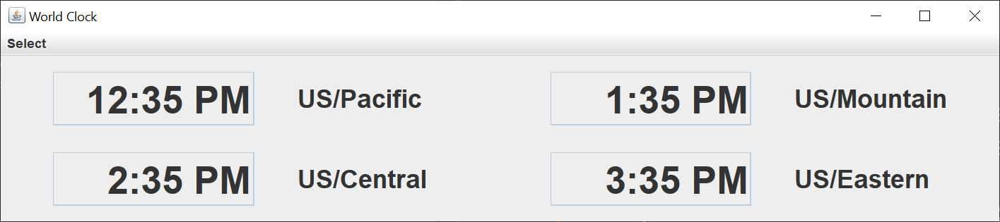
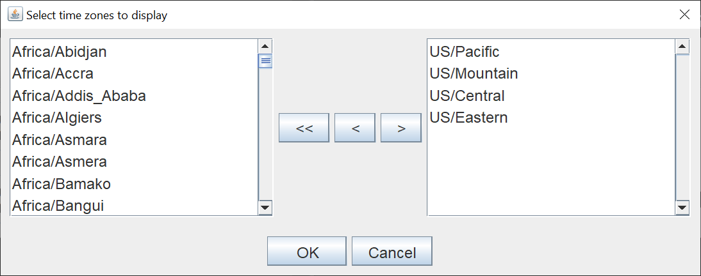

# World Clock

## Introduction

I created a world clock using Java Swing.  The clock itself isn't very complex.  The reason I did this mini-project was to see if I could customize the time zones.

Here's the GUI with the default time zones.

Here's the `JDialog` that shows the various time zones around the world.

You can select as many time zones as you want, although I'd suggest that 10 time zones is the practical limit for most current displays.

Thw `JDialog` allows you to move time zones from the primary list to the display list, and from the display list to the primary list.  You can clear all of the displayed time zones if you want to start over.  You must select at least one time zone to display,

The primary list remains in alphabetical order.  The display list displays the time zones in the order that you select them.  Holding the `Ctrl` key while left-clicking the mouse allows you to select multiple time zones to add or remove from the lists.

This code does not save the time zones you select to a properties file.  This is something that can be added if you want to use this world clock as an executable JAR file.

## Explanation

Oracle has a helpful tutorial, [Creating a GUI With Swing](https://docs.oracle.com/javase/tutorial/uiswing/index.html).  Skip the Learning Swing with the NetBeans IDE section.  

When I create a Swing application, I use the [model-view-controller](https://en.wikipedia.org/wiki/Model%E2%80%93view%E2%80%93controller) (MVC) pattern.  This pattern allows me to separate my concerns and focus on one part of the Swing application at a time.  The pattern name implies that you create the model first, then the view, and finally the controller.  This is an iteratve process, so changes in the view or controller can cause changes in the model.

For a Swing application, the MVC pattern means:

- The view reads information from the model.
- The view does not update the model.
- The controller updates the model and repaints / revalidates the view.

There's usually not one controller to "rule them all".  Each `Action` or `ActionListener` acts independently and updates its part of the model and view.

### Model

I created one model class, the `WorldClockModel` class.  This class holds a `ZonedDateTime` current date and time, a `java.util.List` of all the time zones, and a `java.util.List` of the time zones to be displayed.  I chose a `ZonedDateTime` so that I only have to store the current time once.  I can pass a `ZoneId` to the `ZonedDateTime` to get the current time in any time zone.

The `List` of all the time zones comes from the `ZoneId` `getAvailableZoneIds` method.  I filter out the time zones that aren't city related.

### View

I created two view classes, the`WorldClockGUI` class and the `DisplayPanel` class.  The `WorldClockGUI` class creates the `JFrame` and the main `JPanel`.  The main `JPanel` is composed of `DisplayPanel` instances, one for each time zone to be displayed.

The `JFrame` has a default `BorderLayout`, so I placed the main `JPanel` in the center of the `BorderLayout`.  The main `JPanel` uses a `GridLayout` to put the `DisplayPanel` instances in two evenly spaced columns. 

The `JDialog` shows the list of all the time zones, the list of displayed time zones, and control `JButtons` to move time zones from one list to the other. I use two `DefaultListModels`, one for each list.

### Controller

The `TimezoneDialogListener` class copies the display list from the display `DefaultListModel` back to the application model class and updates the view.

A Swing `Timer` updates the current time every 20 seconds.  This is accurate enough for a clock that displays hours and minutes.

The rest of the `JButtons` on the `JDialog` trigger anonymous `ActionListeners` to perform their tasks.  The listeners are short, so it made sense to manke them anonymous classes.
